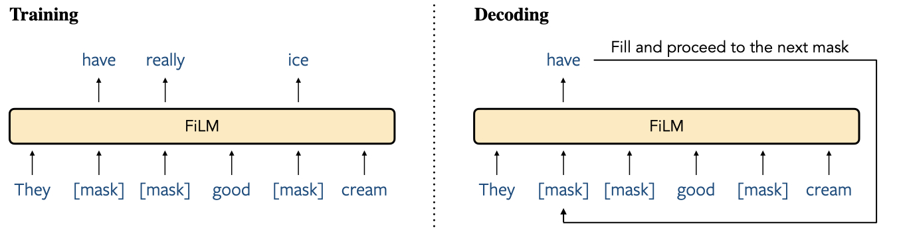

# Fill-in Language Models for Any Order Generation

This repo contains the code for the Fill-in Language Model (FiLM) described in the paper [FiLM: Fill-in Language Models for Any Order Generation](http://arxiv.org/abs/2310.09930) (Shen et al., 2023).

FiLM is an any-order language model that can fill text in the middle:
> Depression, <ins>loneliness</ins> and stress increase <ins>the risk of, say,</ins> drug abuse. 
> I tried going to the park the other day. The weather seemed nice enough for a walk. <ins>However, when I got there I started to itch.</ins> My eyes were watery and it was hard to breathe. My allergies were too bad and I had to go back home.

Its training extends the masked language modeling objective by adopting varying mask probabilities sampled from the Beta distribution to enhance the generative capabilities. At decoding time, FiLM can start with either a sequence entirely of masks or a partially complete text interspersed with masks, and it progressively replaces one mask with a predicted token at each step.


## Install dependencies
```bash
pip install -r requirements.txt
```

## Prepare data
```bash
python -m data_process.get_data --dataset $dataset
bash tokenize.sh $dataset $tokenizer
bash mask.sh $dataset $tokenizer
```
where `$dataset` can be `wikitext-103`, `lm1b`, or `roc_stories`; and `$tokenizer` can be `roberta` or `gpt2`.

## Train
```bash
python -m model.train \
--pretrained_model $pretrained_model \
--train data/$dataset/$tokenizer/train.id --valid data/$dataset/$tokenizer/valid.id \
--save_dir checkpoints/$dataset/film/$pretrained_model \
--max_tokens 20000 --accum_grad 1 --gpus 1 --precision bf16-mixed \
--lr 2e-5 \
--weight_func beta --weight_param 2.5 2.5 \
--train_steps 500000
```
Choose your `$pretrained_model` and corresponding `$tokenizer` from the options below:
- for `roberta-base` and `roberta-large`, set `$tokenizer` to `roberta`;
- for `gpt2`, `gpt2-medium`, `gpt2-large`, and `gpt2-xl`, set `$tokenizer` to `gpt2`.

## Compute perplexity
```bash
python -m model.eval \
--input data/$dataset/$tokenizer/mask/test.mask.all.id --target data/$dataset/$tokenizer/test.id \
--checkpoint checkpoints/$dataset/film/$pretrained_model/lightning_logs/version_0 \
--order $order
```
```bash
python -m eval.ppl_overall \
--len_count data/$dataset/$tokenizer/train.len_count \
--loss_masks checkpoints/$dataset/film/$pretrained_model/lightning_logs/version_0/eval/test.infill.all.$order.loss_masks
```
where `$order` can be `random`, `left2right`, `right2left`, `min-entropy`, or `max-entropy`.

## Generate
```bash
python -m model.generate \
--input data/$dataset/$tokenizer/mask/test.mask.span1.id \
--checkpoint checkpoints/$dataset/film/$pretrained_model/lightning_logs/version_0 \
--order $order --temp 0.8 --top_p 0.95
```
```bash
python -m data_process.extract \
--mask data/$dataset/$tokenizer/mask/test.mask.span1.id \
--infill checkpoints/$dataset/film/$pretrained_model/lightning_logs/version_0/generate/test.infill.span1.id
```
```bash
python -m data_process.id2text \
--tokenizer roberta \
--file checkpoints/$dataset/film/$pretrained_model/lightning_logs/version_0/generate/test.fill.span1.id
```

## Compute evaluation metrics
```bash
python -m eval.rouge \
--ref data/$dataset/$tokenizer/mask/test.fill.span1.id \
--gen checkpoints/$dataset/film/$pretrained_model/lightning_logs/version_0/generate/test.fill.span1.id
```